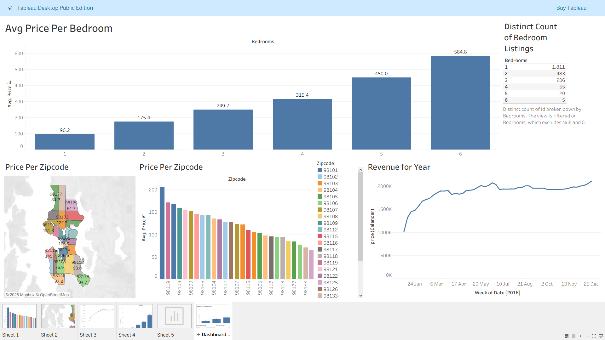

# 📊 Tableau Dashboards Portfolio

This repository contains interactive Tableau dashboards focused on real-world business and data analytics use cases.  
Each project is organized in its own folder with dashboard files, previews, and project details.

---

## 📁 Projects

### 1️⃣ Airbnb Tableau Dashboard

Analyzes Airbnb listings to understand pricing, demand, and revenue trends.
## Dashboard Preview

**Key Insights:**
- Average price by number of bedrooms  
- Listing distribution by bedroom count  
- Price comparison across zip codes  
- Weekly revenue trends  

**Tools Used:** Tableau Public, CSV Dataset  

📂 Folder: airbnb-dashboard

---

## 🛠 Tools & Skills Used

- Tableau Public  
- Data Visualization  
- Data Analysis  
- Dashboard Design  
- Business Insights  

---

## 📌 About Me

Data Analyst skilled in Power BI, Tableau, SQL, Python, and Data Visualization.

This portfolio demonstrates hands-on experience in building real-world analytics dashboards for business decision-making.
